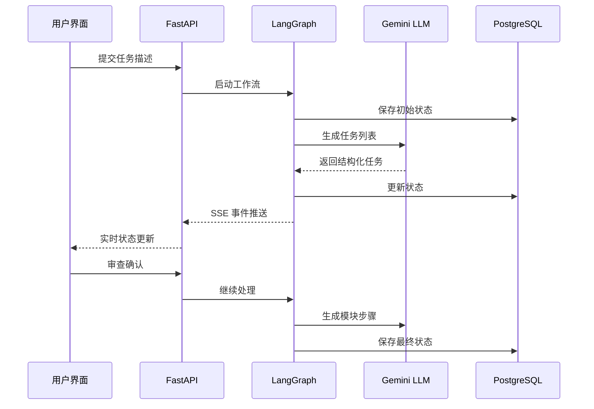

# SAS LangGraph 技术总结报告

## 项目概述

SAS (Sequential Agent System) LangGraph 是一个基于 LangGraph 框架构建的智能任务处理系统，专门用于将自然语言描述的机器人任务转换为可执行的 XML 程序。该系统采用现代化的前后端分离架构，通过 Server-Sent Events (SSE) 实现实时数据流传输，并使用 PostgreSQL 作为持久化状态存储。

### 核心特性

- **智能任务解析**：利用 Google Gemini LLM 将自然语言转换为结构化任务
- **状态驱动架构**：基于 LangGraph 的有限状态机实现复杂工作流
- **实时通信**：SSE 技术实现前后端实时数据同步
- **持久化状态**：PostgreSQL 存储确保状态可恢复性
- **模块化设计**：清晰的节点划分和责任分离
- **可视化流程图**：React + ReactFlow 提供直观的工作流编辑界面

## 技术架构分析

### 前端技术栈 (React + TypeScript)

#### 核心技术组件

- **React 18**: 现代化函数式组件和 Hooks
- **TypeScript**: 类型安全的 JavaScript 超集
- **Material-UI (MUI)**: Google Material Design 风格的组件库
- **Redux Toolkit**: 现代化的状态管理解决方案
- **ReactFlow**: 专业的流程图渲染和编辑库
- **React Router**: 客户端路由管理

#### 架构设计特点

1. **组件化设计**

   - 高度模块化的组件结构
   - 自定义 Hook 实现逻辑复用
   - 懒加载优化性能

2. **状态管理策略**

   - Redux Toolkit 管理全局状态
   - Context API 处理认证和主题
   - 本地状态处理组件级数据

3. **实时通信机制**
   - EventSource API 接收 SSE 事件流
   - 自动重连和错误处理
   - 事件驱动的 UI 更新

### 后端技术栈 (FastAPI + LangGraph)

#### 核心技术组件

- **FastAPI**: 高性能异步 Python Web 框架
- **LangGraph**: 基于 LangChain 的图状态机框架
- **Google Gemini**: 先进的大语言模型
- **PostgreSQL**: 企业级关系数据库
- **AsyncPostgresSaver**: LangGraph 状态持久化
- **PGVector**: PostgreSQL 向量数据库扩展

#### 架构设计特点

1. **API 设计模式**

   - RESTful API 设计原则
   - 路由模块化组织
   - 中间件处理认证和 CORS

2. **异步处理机制**

   - Python asyncio 异步编程
   - 并发任务处理
   - 流式数据传输

3. **状态管理系统**
   - LangGraph StateGraph 状态机
   - PostgreSQL 持久化存储
   - 自动状态检查点保存

### 数据库设计

#### 核心数据模型

1. **用户系统**

   ```python
   - users: 用户基本信息
   - 支持 JWT 身份认证
   - 用户流程关联管理
   ```

2. **流程管理**

   ```python
   - flows: 流程图数据存储
   - flow_variables: 流程变量管理
   - chats: 聊天会话记录
   ```

3. **向量存储**
   ```python
   - json_embeddings: 向量嵌入数据
   - 支持 PGVector 相似性搜索
   - 元数据关联存储
   ```

## SAS LangGraph 工作流核心功能

### 状态机设计

SAS 系统基于 LangGraph 实现了一个复杂的状态机，包含以下核心节点：

#### 1. 初始化节点 (initialize_state_node)

- 设置运行环境和配置
- 创建输出目录
- 处理初始用户输入

#### 2. 任务生成节点 (user_input_to_task_list_node)

- 使用 Gemini LLM 解析自然语言
- 生成结构化任务列表
- 支持任务类型分类

#### 3. 审查节点 (review_and_refine_node)

- 用户交互决策点
- 支持任务列表审查和修改
- 实现反馈循环机制

#### 4. 模块步骤节点 (task_list_to_module_steps_node)

- 并行处理多个任务
- 生成详细执行步骤
- 模板化步骤生成

#### 5. XML 生成节点 (generate_individual_xmls_node)

- 基于模板生成 XML 文件
- 支持多种块类型
- 参数化配置

#### 6. 参数映射节点 (parameter_mapping_node)

- 逻辑参数到实际参数映射
- 参数文件更新
- 映射报告生成

#### 7. XML 合并节点 (merge_xml_node)

- 多个 XML 文件合并
- 生成最终可执行文件
- 文件完整性验证

### 数据流程设计



## 技术亮点分析

### 1. 状态驱动架构

**技术亮点**: 基于 LangGraph 的有限状态机实现复杂工作流管理

**实现方式**:

- 使用 `RobotFlowAgentState` Pydantic 模型定义状态结构
- `AsyncPostgresSaver` 提供状态持久化能力
- 支持状态恢复和断点续传

**优势**:

- 工作流可视化和可调试
- 状态一致性保证
- 异常恢复能力

### 2. 实时数据同步

**技术亮点**: Server-Sent Events (SSE) 实现前后端实时通信

**实现方式**:

- FastAPI SSE 端点流式推送事件
- 前端 EventSource API 接收事件
- 事件驱动的 UI 状态更新

**优势**:

- 低延迟实时更新
- 单向数据流简化架构
- 自动重连机制

### 3. 智能任务处理

**技术亮点**: 集成 Google Gemini LLM 实现自然语言理解

**实现方式**:

- 结构化提示工程
- 流式 LLM 调用
- JSON 格式化输出

**优势**:

- 高质量任务解析
- 支持复杂任务理解
- 可扩展的 LLM 集成

### 4. 并行处理优化

**技术亮点**: 异步并发处理提升系统性能

**实现方式**:

- Python asyncio 异步编程
- 并发任务执行
- 资源池管理

**优势**:

- 高并发处理能力
- 资源利用率优化
- 响应时间缩短

### 5. 模块化设计

**技术亮点**: 高度模块化的系统架构

**实现方式**:

- 清晰的职责分离
- 可插拔的组件设计
- 标准化的接口定义

**优势**:

- 易于维护和扩展
- 组件复用性高
- 测试友好

### 6. 数据库集成策略

**技术亮点**: 双重数据源设计确保数据一致性

**实现方式**:

- PostgreSQL 主数据库
- LangGraph Checkpointer 状态存储
- PGVector 向量数据库

**优势**:

- 数据一致性保证
- 高性能向量搜索
- 状态可恢复性

## 开发框架优势

### 1. 开发效率

- 类型安全的 TypeScript 开发
- 热重载和快速迭代
- 丰富的开发工具支持

### 2. 可维护性

- 清晰的代码组织结构
- 完善的错误处理机制
- 全面的日志记录系统

### 3. 可扩展性

- 微服务友好的架构设计
- 可插拔的组件系统
- 标准化的 API 接口

### 4. 性能优化

- 异步处理提升并发能力
- 前端懒加载优化
- 数据库索引优化

## 技术选型评价

### 前端技术选型

- **React 18**: 成熟稳定，生态丰富
- **TypeScript**: 类型安全，开发效率高
- **Material-UI**: 设计规范统一，组件丰富
- **Redux Toolkit**: 状态管理现代化，样板代码少

### 后端技术选型

- **FastAPI**: 高性能，自动文档生成
- **LangGraph**: 专为 AI 工作流设计，功能强大
- **PostgreSQL**: 企业级数据库，功能全面
- **Google Gemini**: 先进的 LLM，性能优异

## 总结与展望

SAS LangGraph 系统展现了现代化 AI 应用开发的最佳实践，通过合理的技术选型和架构设计，实现了高性能、高可用、易维护的智能任务处理系统。

### 核心优势

1. **技术先进性**: 采用最新的 AI 和 Web 技术栈
2. **架构合理性**: 清晰的分层架构和模块化设计
3. **用户体验**: 实时交互和直观的可视化界面
4. **系统稳定性**: 完善的错误处理和状态恢复机制

### 发展方向

1. **性能优化**: 进一步优化并发处理能力
2. **功能扩展**: 支持更多类型的任务处理
3. **AI 能力**: 集成更多 AI 模型和能力
4. **生态建设**: 构建插件和扩展体系

该系统为 AI 驱动的工作流自动化提供了一个优秀的技术框架和实践案例，具有很高的技术价值和应用前景。
