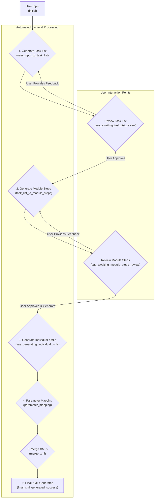

# SAS (Sequential Agent System) LangGraph Workflow

## Overview

The SAS LangGraph workflow is a sophisticated agent system designed to convert natural language descriptions of robotic tasks into executable, structured XML files. It leverages a state machine built with LangGraph to manage a multi-step process that includes LLM-based generation, user review cycles, and template-based code generation.

The system is designed to be interactive, allowing users to review and refine the generated plans at two critical stages, ensuring the final output accurately reflects their intent.

## Core Workflow

The entire process is modeled as a state graph, where each node represents a specific processing step and edges represent the flow of control. The workflow has been significantly simplified to a linear process with two main user review loops.

## State Management (`RobotFlowAgentState`)

The consistency and durability of the workflow are managed through a central state object, `RobotFlowAgentState`, defined in `backend/sas/state.py`. This Pydantic model encapsulates all the data required for the agent to operate, and it is automatically persisted to a PostgreSQL database after each step by a LangGraph checkpointer.

### Key State Variables

- **`messages`**: A list of `BaseMessage` objects that form the conversation history.
- **`dialog_state`**: A `Literal` type that represents the current stage of the workflow (e.g., `initial`, `sas_awaiting_task_list_review`). This is the primary variable used for routing decisions.
- **`user_input`**: The most recent input from the user, which is typically consumed by a node and then cleared.
- **`current_user_request`**: The active user request that serves as the basis for the current generation flow. This is updated with user feedback during review cycles.
- **`sas_step1_generated_tasks`**: The structured list of tasks (`List[TaskDefinition]`) generated from the user's request. This serves as the single source of truth for the task plan.
- **`sas_step2_module_steps`**: A formatted string containing the detailed, executable module steps generated for all tasks.
- **`task_list_accepted`** & **`module_steps_accepted`**: Boolean flags that track user approval at the two main review points. They are critical for the conditional routing logic.
- **`is_error`** & **`error_message`**: Used for robust error handling throughout the graph.
- **`generated_node_xmls`**: A list of `GeneratedXmlFile` objects containing metadata about each successfully (or unsuccessfully) generated XML file.

## Key Nodes & Logic

The graph is composed of several key nodes, each with a distinct responsibility:

1.  **`initialize_state_node`**: The entry point of the graph. It sets up the initial state, creates a run-specific output directory, and processes the very first user input.

2.  **`user_input_to_task_list_node`**: Takes the `current_user_request` and uses an LLM to generate a structured list of high-level tasks, populating `sas_step1_generated_tasks`.

3.  **`review_and_refine_node`**: This node acts as a gate for user interaction. It transitions the `dialog_state` to a waiting state (e.g., `sas_awaiting_task_list_review`), which pauses the graph. The actual user approval or feedback is handled by the API layer (`sas_chat.py`), which updates the state's boolean flags or revises `current_user_request` before reinvoking the graph.

4.  **`task_list_to_module_steps_node`**: Once the task list is approved, this node runs in parallel for each task in `sas_step1_generated_tasks` to generate detailed, executable module steps. The consolidated output is stored in `sas_step2_module_steps`.

5.  **`generate_individual_xmls_node`**: After the module steps are approved, this node uses a template-based approach (not an LLM) to generate individual XML files for each step, based on the templates found in the `node_database`.

6.  **`parameter_mapping_node`**: This node (currently a placeholder) is responsible for analyzing the generated steps, extracting logical parameters (e.g., "safe point"), and mapping them to available slots in the robot's parameter files.

7.  **`sas_merge_xml_node`**: The final step, which takes all the individually generated XML files for each task and merges them into a single, cohesive XML file representing the complete robot program for that task.

## Routing and Conditionals

The file `graph_builder.py` defines the graph's structure using `workflow.add_conditional_edges`. Each routing function (e.g., `route_after_sas_review_and_refine`) is a simple Python function that inspects the current `RobotFlowAgentState` and returns the name of the next node to execute.

This design makes the control flow explicit and easy to debug. For example, the `route_after_sas_review_and_refine` function checks `state.task_list_accepted` and `state.module_steps_accepted` to decide whether to proceed to the next generation step, loop back for regeneration based on user feedback, or wait for further user input.

## Persistence

The SAS workflow is designed for durability. It uses an `AsyncPostgresSaver` as a LangGraph checkpointer. After every node execution, the entire `RobotFlowAgentState` is automatically serialized and saved to a PostgreSQL database. This ensures that even if the application restarts, the state of any ongoing workflow can be perfectly restored and resumed.
