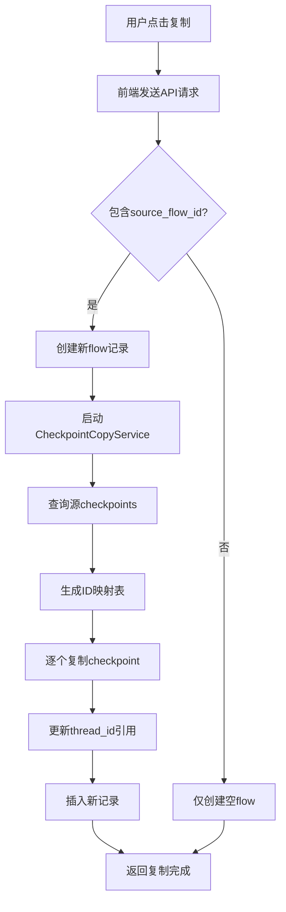

# Flow 复制功能 - Checkpoint 完整复制解决方案

## 问题背景

原始的流程图复制功能存在根本性缺陷：

- **只复制了状态快照**：仅复制了`sas_state`数据
- **缺失历史记录**：没有复制 LangGraph 在 PostgreSQL 中的完整 checkpoint 历史
- **无法正确恢复**：复制的 flow 无法访问原 flow 的执行历史和中间状态
- **删除不完整**：删除 flow 时没有清理对应的 checkpoint 数据，造成数据库垃圾
- **创建不完整**：新建 flow 时没有初始化 checkpointer，首次使用时会出错

## 真正的解决方案

### 🎯 **核心理解**

LangGraph 使用 AsyncPostgresSaver 将状态存储在 PostgreSQL 的`checkpoints`表中：

```sql
-- checkpoints表结构（简化）
CREATE TABLE checkpoints (
    checkpoint_id UUID PRIMARY KEY,
    thread_id TEXT,                 -- 对应flow_id
    parent_checkpoint_id UUID,      -- 形成历史链
    checkpoint JSONB,               -- 完整状态数据
    metadata JSONB,
    created_at TIMESTAMP,
    type TEXT
);
```

### 🔧 **技术实现**

#### 1. 后端服务：CheckpointCopyService

```python
class CheckpointCopyService:
    async def copy_checkpoints(self, source_thread_id: str, target_thread_id: str) -> bool:
        """复制完整的checkpoint历史链"""

        # 1. 获取源thread_id的所有checkpoints（按时间排序）
        source_checkpoints = await self._get_checkpoints_by_thread_id(source_thread_id)

        # 2. 创建checkpoint_id映射表
        checkpoint_id_mapping = {}

        # 3. 逐个复制checkpoint，保持parent关系
        for checkpoint_row in source_checkpoints:
            await self._copy_single_checkpoint(
                checkpoint_row,
                target_thread_id,
                checkpoint_id_mapping
            )

    async def delete_checkpoints(self, thread_id: str) -> bool:
        """删除指定thread_id的所有checkpoints"""
        delete_query = "DELETE FROM checkpoints WHERE thread_id = :thread_id"
        self.db.execute(text(delete_query), {"thread_id": thread_id})
        self.db.commit()

    async def initialize_empty_checkpointer(self, thread_id: str) -> bool:
        """为新的flow初始化一个空的checkpointer状态"""
        initial_state = {
            "thread_id": thread_id,
            "flow_id": thread_id,
            "current_step": "initial",
            "initialized": True
        }
        # 插入初始checkpoint记录
        # ...
```

#### 2. 前端 API 调用

```typescript
// 前端发送复制请求时包含源flow_id
const flowCreateData = {
  name: newFlowName,
  flow_data: remappedFlowData,
  source_flow_id: flowId, // 关键：指定源flow_id
};

const newFlow = await createFlow(flowCreateData);
```

#### 3. 后端 API 处理

```python
@router.post("/", response_model=schemas.Flow)
async def create_flow(flow_data: schemas.FlowCreate, ...):
    # 1. 创建数据库记录
    new_db_flow = await flow_service.create_flow(...)

    # 2. 处理 checkpoint 初始化
    checkpoint_service = CheckpointCopyService(db)
    if flow_data.source_flow_id:
        # 复制现有 flow 的 checkpoint 历史
        await checkpoint_service.copy_checkpoints(
            source_thread_id=flow_data.source_flow_id,
            target_thread_id=str(new_db_flow.id)
        )
    else:
        # 新建 flow，初始化空的 checkpointer
        await checkpoint_service.initialize_empty_checkpointer(str(new_db_flow.id))

@router.delete("/{flow_id}", response_model=bool)
async def delete_flow(flow_id: str, ...):
    # 1. 删除 checkpoint 数据
    checkpoint_service = CheckpointCopyService(db)
    await checkpoint_service.delete_checkpoints(flow_id)

    # 2. 删除数据库记录
    await flow_service.delete_flow(flow_id=flow_id)
```

### 🏗️ **复制过程详解**

1. **获取源数据**：从 checkpoints 表读取原 flow_id 的所有记录
2. **生成新 ID**：为每个 checkpoint 生成新的 checkpoint_id
3. **维护关系链**：保持 parent_checkpoint_id 的正确映射
4. **更新引用**：修改 checkpoint 数据中的 thread_id 引用
5. **批量插入**：将所有记录插入新的 thread_id

### 📊 **数据流程图**



### 🧪 **测试验证**

```bash
# 1. 检查checkpoints表结构
python backend/tests/test_flow_duplication_with_checkpoints.py

# 2. 测试checkpoint复制
python backend/tests/test_flow_duplication_with_checkpoints.py <source_flow_id>
```

### ✅ **验证清单**

复制完成后应验证：

1. **数据库记录**：

   ```sql
   SELECT COUNT(*) FROM checkpoints WHERE thread_id = '<new_flow_id>';
   ```

2. **历史完整性**：

   - 新 flow 的 checkpoint 数量 = 原 flow 的 checkpoint 数量
   - parent_checkpoint_id 关系正确维护

3. **状态一致性**：

   - checkpoint 中的 thread_id 已更新为新 flow_id
   - 其他状态数据保持完整

4. **功能验证**：
   - 新 flow 可以正常使用 LangGraph 功能
   - 状态历史可以正确访问和回退

### 🚨 **重要说明**

#### 与之前方案的区别

| 方面     | 之前的方案   | 新方案               |
| -------- | ------------ | -------------------- |
| 复制内容 | 仅状态快照   | 完整 checkpoint 历史 |
| 数据存储 | 前端处理     | PostgreSQL 直接操作  |
| 历史记录 | 丢失         | 完整保留             |
| 恢复能力 | 无法回退     | 支持历史回退         |
| 复杂度   | 简单但不完整 | 复杂但完整           |

#### 技术要点

1. **事务安全**：复制失败时自动清理部分数据
2. **ID 映射**：确保 parent 关系在新环境中正确
3. **引用更新**：递归更新 checkpoint 内的 thread_id 引用
4. **性能考虑**：批量操作，避免逐条提交

### 📁 **相关文件**

| 文件                                                      | 用途                     |
| --------------------------------------------------------- | ------------------------ |
| `backend/app/services/checkpoint_copy_service.py`         | 核心复制服务             |
| `backend/app/schemas.py`                                  | 添加 source_flow_id 字段 |
| `backend/app/routers/flow.py`                             | 集成复制服务             |
| `frontend/src/api/flowApi.ts`                             | 前端 API 调用            |
| `backend/tests/test_flow_duplication_with_checkpoints.py` | 测试脚本                 |

### 🎉 **最终效果**

- ✅ 完整复制 LangGraph 执行历史
- ✅ 保持所有 checkpoint 关系
- ✅ 支持状态回退和恢复
- ✅ 新 flow 功能完全独立
- ✅ 原 flow 不受任何影响
- ✅ 删除 flow 时完全清理 checkpoint 数据
- ✅ 新建 flow 时自动初始化 checkpointer
- ✅ 避免数据库垃圾积累

这个解决方案真正解决了 checkpoint 持久化复制的核心问题，确保复制的 flow 拥有完整的执行历史，同时保证了数据的完整性和一致性。
