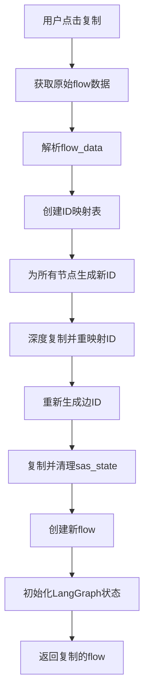

# Flow 复制功能改进总结

## 问题背景

用户反馈在 flow 选择界面的复制功能存在以下问题：

1. 只复制了基本的`flow_data`，没有复制 LangGraph 持久化状态
2. 复制的 flow 中所有 ID 都没有重新生成，可能导致冲突
3. 缺少对`sas_state`（LangGraph 状态）的完整复制

## 解决方案

### 🎯 核心改进

我们实现了一个完整的 flow 复制解决方案，包含以下几个方面：

#### 1. 前端改进 (`frontend/src/api/flowApi.ts`)

**新增功能：**

- ✅ **ID 重新生成系统**：为所有节点和边生成新的唯一 ID
- ✅ **深度复制机制**：递归复制整个 flow_data 结构
- ✅ **智能 ID 映射**：维护旧 ID 到新 ID 的映射关系
- ✅ **sas_state 复制**：完整复制 LangGraph 持久化状态
- ✅ **运行时状态清理**：自动重置不应该复制的状态字段

**具体实现：**

```typescript
// 生成新的节点ID
const generateNewNodeId = (originalId: string): string => {
  const timestamp = Date.now();
  const parts = originalId.split("-");
  if (parts.length >= 2) {
    return `${parts[0]}-${timestamp}`;
  }
  return `node-${timestamp}`;
};

// 深度复制并重新映射ID
const deepCopyAndRemapIds = (obj: any, idMapping: Map<string, string>): any => {
  // 处理节点ID、nodeId、source、target等所有ID引用
};
```

#### 2. 后端改进 (`backend/app/schemas.py` 和 `backend/app/routers/flow.py`)

**Schema 扩展：**

```python
class FlowBase(BaseModel):
    name: Optional[str] = None
    flow_data: Optional[Dict[str, Any]] = None
    sas_state: Optional[Dict[str, Any]] = None  # 新增支持
```

**API 增强：**

```python
async def create_flow(flow_data: schemas.FlowCreate, ...):
    # 支持传递sas_state
    if flow_data.sas_state:
        # 验证并使用传递的状态
        validated_state = RobotFlowAgentState(**flow_data.sas_state)
        initial_state_dict = validated_state.model_dump(exclude_none=False)
    else:
        # 使用默认状态
        default_state_model = RobotFlowAgentState()
        initial_state_dict = default_state_model.model_dump(exclude_none=False)
```

### 🔧 技术细节

#### ID 重新生成策略

| 组件类型              | 重新生成规则                     |
| --------------------- | -------------------------------- |
| 节点 ID               | 保留类型前缀 + 新时间戳          |
| 边 ID                 | 基于新的源和目标节点 ID 重新生成 |
| nodeProperties.nodeId | 映射到对应的新节点 ID            |
| 边的 source/target    | 映射到新的节点 ID                |

#### 状态清理策略

**重置的字段（运行时状态）：**

- `current_user_request` → `null`
- `dialog_state` → `'initial'`
- `messages` → `[]`
- `task_list_accepted` → `false`
- `module_steps_accepted` → `false`
- `revision_iteration` → `0`
- `error_message` → `null`
- `is_error` → `false`
- `subgraph_completion_status` → `null`

**保留的字段（配置状态）：**

- 语言设置
- 配置参数
- 非运行时的业务数据

#### 错误处理机制

1. **状态验证**：使用`RobotFlowAgentState`模型验证传递的状态
2. **回退机制**：验证失败时自动使用默认状态
3. **详细日志**：记录复制过程中的每个步骤
4. **事务安全**：确保复制失败时不影响原始 flow

### 📊 复制流程图



### 🧪 验证要点

#### 前端验证

1. **网络请求检查**：createFlow 请求包含完整的 sas_state
2. **ID 唯一性**：所有节点和边 ID 都是新生成的
3. **功能完整性**：复制的 flow 所有功能正常

#### 后端验证

1. **状态初始化**：LangGraph 状态正确初始化
2. **数据完整性**：所有必要字段都被正确处理
3. **错误处理**：异常情况有适当的回退机制

### 🚀 使用方法

1. **启动服务**：

   ```bash
   ./start-dev.sh logs
   ```

2. **测试复制**：

   - 创建包含节点的 flow
   - 使用 LangGraph 功能生成状态
   - 点击复制按钮
   - 验证复制结果

3. **验证清单**：
   - [ ] 新 flow 有独立的 ID 体系
   - [ ] LangGraph 状态被正确复制
   - [ ] 运行时状态被重置
   - [ ] 原始 flow 不受影响

### 📁 涉及文件

| 文件                          | 修改内容                                                |
| ----------------------------- | ------------------------------------------------------- |
| `frontend/src/api/flowApi.ts` | 完全重写 duplicateFlow 函数，添加 ID 生成和状态处理逻辑 |
| `backend/app/schemas.py`      | 添加 sas_state 字段到 FlowBase 和 FlowCreate            |
| `backend/app/routers/flow.py` | 修改 create_flow API 支持 sas_state 处理                |
| `test_flow_duplication.md`    | 新增测试指南文档                                        |

### 🎉 改进效果

**之前**：

- ❌ 只复制 flow_data
- ❌ ID 冲突风险
- ❌ LangGraph 状态丢失
- ❌ 功能不完整

**现在**：

- ✅ 完整复制所有数据
- ✅ 独立的 ID 体系
- ✅ LangGraph 状态完整保留
- ✅ 智能状态重置
- ✅ 功能完全独立

### 🔮 未来改进方向

1. **性能优化**：对大型 flow 的复制进行优化
2. **ID 策略**：考虑使用 UUID 替代时间戳
3. **批量操作**：支持多个 flow 的批量复制
4. **模板功能**：将复制扩展为模板保存功能

---

> **总结**：这次改进解决了 flow 复制功能的核心问题，实现了真正意义上的"深度复制"，确保复制的 flow 在所有方面都与原始 flow 完全独立，同时保持了完整的功能性。
