# SAS LangGraph 再利用性ガイド フローチャート

このドキュメントは、`SAS_LangGraph_Reusability_Guide_JA.md` の内容を視覚的に表現したものです。フレームワークを新しいドメインに適応させるための主要なステップと、システムのコアコンポーネントを図解します。

```mermaid
graph TD
    subgraph "新ドメインへの適応プロセス"
        A["<div style='font-size:18px; font-weight:bold; padding:10px;'>入力<br>自然言語によるタスク記述</div>"]:::input --> S1;

        S1("<b>ステップ1: ナレッジベースの再定義</b><br>ドメイン固有の「アトミック能力」を定義する<br><i>例: 画像処理用の関数群</i>"):::step;
        S2("<b>ステップ2: プロンプトの更新</b><br>LLMに新しいツールセットとコンテキストを指示する<br><i>例: 「ロボット」→「画像」</i>"):::step;
        S3("<b>ステップ3: AgentStateの汎用化</b><br>ドメイン固有の状態を削除し、汎用化する<br><i>例: RobotFlowAgentState → AgentState</i>"):::step;
        S4("<b>ステップ4: コード生成ノードの置換</b><br>最終的な出力を生成するロジックを置き換える<br><i>例: XML生成 → Pythonスクリプト生成</i>"):::step;
        S5("<b>ステップ5: 検証スキーマの調整</b><br>入力タスクの構造を定義するスキーマを修正する<br><i>例: 新タスク用のPydanticモデル</i>"):::step;

        S1 --> S2 --> S3 --> S4 --> S5;

        S5 --> B["<div style='font-size:18px; font-weight:bold; padding:10px;'>出力<br>ターゲットドメインのコード</div>"]:::output;
    end

    subgraph "フレームワークの構成要素"
        direction LR

        subgraph "コアアーキテクチャ (不変)"
            C1["メインワークフローグラフ"]
            C2["状態管理 (AgentState)"]
            C3["レビューノード (Human-in-the-Loop)"]
            C4["スキーマ駆動入力解析"]
        end

        subgraph "ドメイン固有コンポーネント (交換可能)"
            D1["ナレッジベース"]
            D2["プロンプト"]
            D3["コードジェネレータ"]
        end
    end

    %% スタイル定義
    classDef input fill:#d6eaf8,stroke:#3498db,stroke-width:2px,color:#2874a6;
    classDef output fill:#d5f5e3,stroke:#2ecc71,stroke-width:2px,color:#28b463;
    classDef step fill:#fef9e7,stroke:#f1c40f,stroke-width:2px,color:#b7950b;
    classDef core fill:#f2f2f2,stroke:#5d6d7e,stroke-width:2px,color:#34495e;
    classDef adaptable fill:#fdebd0,stroke:#e67e22,stroke-width:2px,color:#af601a;

    class C1,C2,C3,C4 core;
    class D1,D2,D3 adaptable;

```

### フローチャートのプレビュー方法

この Markdown ファイルを Mermaid.js に対応したビューア（例: Visual Studio Code の拡張機能、GitHub、またはオンラインの Mermaid エディタ）で開くと、以下のようなフローチャートが表示されます。

- **プロセスフロー**: 上部の「新ドメインへの適応プロセス」は、ガイドに記載されている 5 つのステップを順を追って示しています。
- **構成要素**: 下部の「フレームワークの構成要素」は、再利用可能な「コアアーキテクチャ」と、ドメインごとに変更が必要な「ドメイン固有コンポーネント」を分類して示しています。
- **デザイン**: モダンでプロフェッショナルな外観になるよう、色分けとスタイル設定を行いました。各要素が直感的に理解できるようになっています。

これで、要求された仕様を満たす、専門的で視覚的に優れたフローチャートが作成されました。
