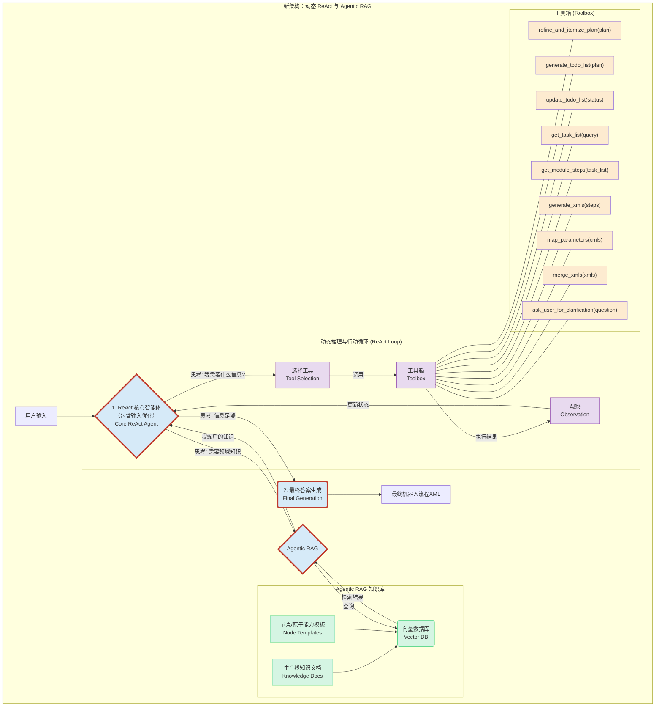

# SOTA Agent 架构图

以下是 `SOTA_Agent_Refactoring_Plan.md` 中描述的新架构的 Mermaid 图表代码。您可以在支持 Mermaid 的 Markdown 查看器（如 VSCode 预览）中直接看到渲染后的图表。

```mermaid
graph TD
    subgraph "新架构：动态 ReAct 与 Agentic RAG"
        A[用户输入] --> C{1. ReAct 核心智能体<br>（包含输入优化）<br>Core ReAct Agent};

        subgraph "动态推理与行动循环 (ReAct Loop)"
            direction LR
            C -- 思考: 我需要什么信息? --> D[选择工具<br>Tool Selection];
            D -- 调用 --> E[工具箱<br>Toolbox];
            E -- 执行结果 --> F[观察<br>Observation];
            F -- 更新状态 --> C;
        end

        subgraph "Agentic RAG 知识库"
            direction TB
            G[生产线知识文档<br>Knowledge Docs] --> H(向量数据库<br>Vector DB);
            I[节点/原子能力模板<br>Node Templates] --> H;
        end

        subgraph "工具箱 (Toolbox)"
            T0["refine_and_itemize_plan(plan)"]
            T1["generate_todo_list(plan)"]
            T2["update_todo_list(status)"]
            T3["get_task_list(query)"]
            T4["get_module_steps(task_list)"]
            T5["generate_xmls(steps)"]
            T6["map_parameters(xmls)"]
            T7["merge_xmls(xmls)"]
            T8["ask_user_for_clarification(question)"]
        end

        E --- T0 & T1 & T2 & T3 & T4 & T5 & T6 & T7 & T8

        C -- 思考: 信息足够 --> J(2. 最终答案生成<br>Final Generation);
        J --> K[最终机器人流程XML];

        C -- 思考: 需要领域知识 --> R{Agentic RAG};
        R -- 查询 --> H;
        H -- 检索结果 --> R;
        R -- 提炼后的知识 --> C;
    end

    %% Styling
    classDef agent fill:#d6eaf8,stroke:#3498db;
    classDef loop fill:#e8daef,stroke:#8e44ad;
    classDef tool fill:#fdebd0,stroke:#e6722;
    classDef rag fill:#d5f5e3,stroke:#2ecc71;
    classDef newDev stroke-width:4px,stroke:#c0392b;

    class C,J,R agent;
    class C,J,R newDev;
    class D,E,F loop;
    class T0,T1,T2,T3,T4,T5,T6,T7,T8 tool;
    class G,H,I rag;
```
