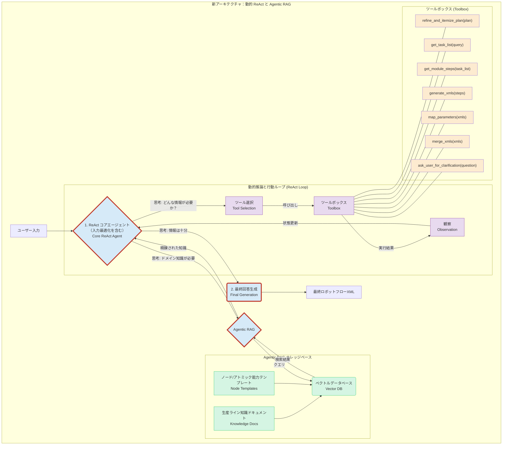

# SOTA Agent アーキテクチャ図

以下は `SOTA_Agent_Refactoring_Plan.md` で説明されている新しいアーキテクチャの Mermaid チャートコードです。Mermaid をサポートする Markdown ビューア（VSCode プレビューなど）でレンダリングされた図を直接確認できます。

```mermaid
graph TD
    subgraph "新アーキテクチャ：動的 ReAct と Agentic RAG"
        A[ユーザー入力] --> C{1. ReAct コアエージェント<br>（入力最適化を含む）<br>Core ReAct Agent};

        subgraph "動的推論と行動ループ (ReAct Loop)"
            direction LR
            C -- 思考: どんな情報が必要か？ --> D[ツール選択<br>Tool Selection];
            D -- 呼び出し --> E[ツールボックス<br>Toolbox];
            E -- 実行結果 --> F[観察<br>Observation];
            F -- 状態更新 --> C;
        end

        subgraph "Agentic RAG ナレッジベース"
            direction TB
            G[生産ライン知識ドキュメント<br>Knowledge Docs] --> H(ベクトルデータベース<br>Vector DB);
            I[ノード/アトミック能力テンプレート<br>Node Templates] --> H;
        end

        subgraph "ツールボックス (Toolbox)"
            T0["refine_and_itemize_plan(plan)"]
            T1["get_task_list(query)"]
            T2["get_module_steps(task_list)"]
            T3["generate_xmls(steps)"]
            T4["map_parameters(xmls)"]
            T5["merge_xmls(xmls)"]
            T6["ask_user_for_clarification(question)"]
        end

        E --- T0 & T1 & T2 & T3 & T4 & T5 & T6

        C -- 思考: 情報は十分 --> J(2. 最終回答生成<br>Final Generation);
        J --> K[最終ロボットフローXML];

        C -- 思考: ドメイン知識が必要 --> R{Agentic RAG};
        R -- クエリ --> H;
        H -- 検索結果 --> R;
        R -- 精錬された知識 --> C;
    end

    %% Styling
    classDef agent fill:#d6eaf8,stroke:#3498db;
    classDef loop fill:#e8daef,stroke:#8e44ad;
    classDef tool fill:#fdebd0,stroke:#e6722;
    classDef rag fill:#d5f5e3,stroke:#2ecc71;
    classDef newDev stroke-width:4px,stroke:#c0392b;

    class C,J,R agent;
    class C,J,R newDev;
    class D,E,F loop;
    class T0,T1,T2,T3,T4,T5,T6 tool;
    class G,H,I rag;
```
