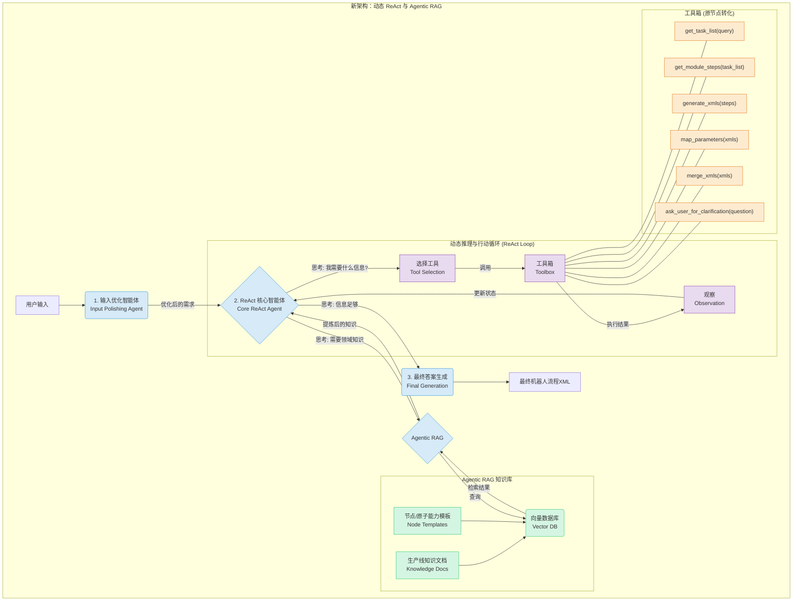

# **面向 SOTA 智能体的系统重构计划**

本文档旨在规划将现有 LangGraph 多智能体系统，升级为一个遵循 `ReAct (Reasoning-Act)` 原则和 `Agentic RAG` 思想的 SOTA (State-of-the-Art) 智能体系统的重构方案。

## **1. 核心分析：现状 vs. 目标**

### **1.1. 现有系统分析**

- **架构模式**: 当前系统是一个预定义的、线性的**状态机 (State Machine)**。流程严格按照 `A -> B -> C` 的顺序执行，更像一个自动化的“流水线”或“管道 (Pipeline)”。
- **智能体现**: 系统的“智能”主要局限于单个 LLM 节点内部的 NLP 处理能力。整个系统的宏观决策逻辑由图的静态结构**硬编码**决定，缺乏动态适应性。
- **RAG 模式**: 知识库的利用方式是**基于规则的、静态的 RAG**。系统根据任务类型，从固定的文件路径加载精确的模板和知识，这是一种“精确查找”，而非灵活的“语义检索”。

### **1.2. 目标系统 (SOTA Agent) 愿景**

- **ReAct (Reasoning-Act) 原则**: 系统的核心将是一个动态的**“思考 -> 行动 -> 观察”**循环。智能体需要能根据当前目标和上下文，自主地**选择并调用工具 (Action)**，然后根据工具返回的结果 (Observation) 进行下一步的**思考 (Reasoning)**，动态规划执行路径。
- **Agentic RAG**: 智能体将**主动地、迭代地与知识库交互**。它不再被动接收检索结果，而是能够评估信息质量、**改写查询**、在多个信息源间进行综合推理，并自主决定何时停止检索。
- **输入优化 (Polishing)**: 在任务执行前，引入一个前置步骤。智能体利用外部领域知识（如生产线文档）来**理解、澄清、补全**用户的原始输入，使其转化为更精确、更符合领域规范的指令。

## **2. 结论：重构 vs. 重写**

**建议进行一次彻底的、根本性的“重构”，而非从零“重写”。**

**理由**:

1.  **保留有价值的资产**: 现有系统中许多确定性的功能节点 (如 `GENERATE_INDIVIDUAL_XMLS`, `SAS_MERGE_XMLS` 等) 是宝贵的开发成果。重构可以将它们封装成新架构下的**工具 (Tools)**，避免重复开发。
2.  **范式转移 (Paradigm Shift)**: 本次升级的核心是从**“预定义流程”到“动态推理循环”**的范式转移。因此，重构的重点是替换顶层的控制逻辑，而不是废弃所有的底层功能模块。

## **3. 新架构设计**

新架构将引入一个更加动态和智能的控制流程，由专门的智能体负责不同的阶段。

## **4. 详细重构步骤**

1.  **搭建 Agentic RAG 知识库**:

    - **任务**: 将现有的生产线文档、`node_database` 中的模板等知识源进行处理和向量化。
    - **实施**: 选用合适的 Embedding 模型，将文档切块后存入向量数据库（如 ChromaDB, FAISS, PGVector 等）。
    - **目标**: 为后续的智能体提供一个可进行语义检索的知识基础。

2.  **实现输入优化智能体 (Input Polishing Agent)**:

    - **任务**: 创建一个专门的前置智能体，负责与用户交互以优化输入。
    - **实施**: 该智能体接收用户原始输入后，首先通过 RAG 检索相关知识以发现潜在的歧义或缺失信息。然后，它可以生成澄清性问题，主动与用户进行对话，直到获得一个清晰、无歧义、信息完整的任务描述。
    - **目标**: 确保进入核心流程的需求是高质量的。

3.  **设计新的 ReAct 核心智能体**:

    - **任务**: 构建系统的新“大脑”，取代当前的 Supervisor 状态机。
    - **实施**: 使用 LangChain 或类似框架，实现一个遵循 ReAct 范式的 Agent。该 Agent 的核心是一个循环：根据目标和历史记录进行思考 (`Reasoning`)，决定下一步的行动 (`Action`，即选择调用哪个工具)，然后处理行动的结果 (`Observation`)。
    - **目标**: 实现一个能够动态规划和执行任务的智能核心。

4.  **将现有节点封装为工具 (Tools)**:

    - **任务**: 将现有 LangGraph 图中的功能节点（如 `SAS_USER_INPUT_TO_TASK_LIST`, `SAS_TASK_LIST_TO_MODULE_STEPS` 等）改写为独立的、可供 ReAct 智能体调用的函数/工具。
    - **实施**: 为每个函数定义清晰的输入、输出和功能描述。这个描述至关重要，因为 ReAct 智能体将依据它来决定何时使用哪个工具。
    - **目标**: 复用现有功能，并将其纳入新的 Agentic 架构中。

5.  **升级状态管理模型 (AgentState)**:

    - **任务**: 调整 `RobotFlowAgentState` 以适应 ReAct 循环的需求。
    - **实施**: 在 Pydantic 模型中增加用于 ReAct 循环的关键字段，例如 `scratchpad` (用于存放中间的思考过程) 和 `intermediate_steps` (用于记录工具的调用历史和返回结果)。
    - **目标**: 建立一个能够承载新架构下复杂状态流转的数据结构。

6.  **整合与端到端测试**:
    - **任务**: 将所有新组件（Agentic RAG, 输入优化智能体, ReAct 核心智能体, 工具集）整合到 LangGraph 中。
    - **实施**: 构建新的图，将优化智能体和核心智能体连接起来，并为核心智能体提供所有封装好的工具。设计多种测试用例，验证整个流程是否能按预期工作。
    - **目标**: 确保重构后的系统能够稳定、高效地完成端到端的任务。
