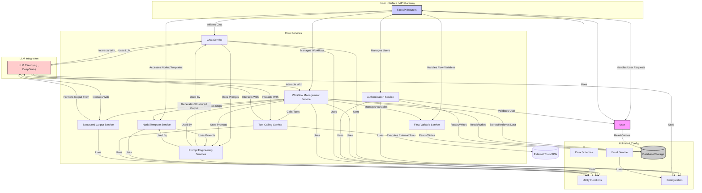

# Backend App Analysis (`backend/app`)

## 功能概述

`backend/app` 文件夹包含了一个基于 FastAPI 的后端应用程序。其核心功能围绕 AI 工作流 (workflow)、聊天 (chat)、提示工程 (prompt engineering) 以及与大型语言模型 (LLM) 的交互。

**主要模块:**

- **认证与用户 (`auth`, `user`, `utils_auth`)**: 处理用户身份验证和管理。
- **聊天 (`chat`, `chat_service`)**: 实现用户与 AI 的聊天交互。
- **工作流 (`flow`, `workflow_router`, `flow_service`, `user_flow_service`)**: 定义、执行和管理复杂 AI 工作流程（核心）。
- **LLM 集成 (`llm`, `deepseek_client_service`)**: 封装与特定 LLM (如 DeepSeek) 的交互逻辑。
- **提示工程 (`*_prompt_*`)**: 管理和优化用于 LLM 的提示词，包括生成、嵌入、扩展等。
- **节点与模板 (`node_templates`, `node_template_service`)**: 管理工作流中的节点类型和模板。
- **工具调用 (`tool_calling_service`)**: 使 LLM 能够调用外部工具/函数。
- **结构化输出 (`structured_output_service`)**: 处理和生成结构化的 LLM 输出。
- **其他**: 邮件、流程变量、配置、数据模型 (`schemas`)、工具函数 (`utils`) 等。

## 开发进度

- **结构**: 清晰，遵循 FastAPI 最佳实践。
- **功能**: 丰富，尤其在工作流、提示工程和 LLM 方面。
- **状态**: 核心功能已开发，代码量较大，可能处于活跃开发阶段。

## 组件交互图 (Mermaid)

**注意:** 这个图表是基于文件结构和名称推断的简化表示，实际交互可能更复杂。
