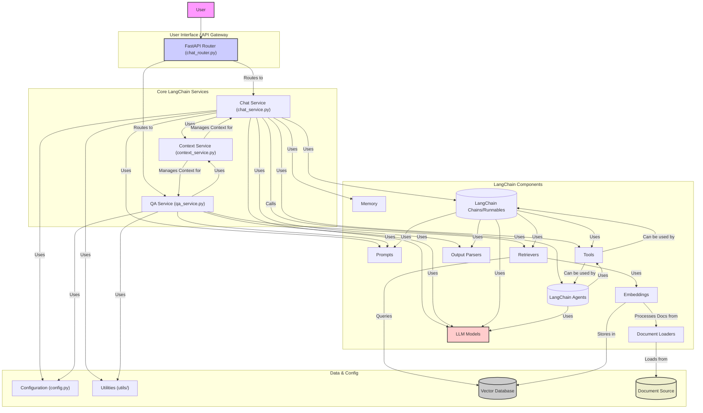

# Backend LangchainChat Analysis (`backend/langchainchat`)

## 功能概述

`backend/langchainchat` 文件夹包含了一个基于 **LangChain** 框架构建的后端应用程序。其核心功能是提供聊天能力，很可能利用了 LangChain 的丰富组件生态。

**主要特点与模块:**

- **框架**: 明确使用 LangChain，目录结构（`agents`, `chains`, `memory`, `prompts`, `retrievers`, `tools`, `embeddings`, `document_loaders` 等）遵循其标准。
- **API 入口**: 通过 `api/chat_router.py` 提供聊天接口。
- **核心服务**:
  - `services/chat_service.py`: 聊天功能的核心实现，协调 LangChain 组件。
  - `services/context_service.py`: 可能管理上下文或用于 RAG。
  - `services/qa_service.py`: 提供专门的问答功能。
- **LangChain 组件**: 应用集成了或准备集成多种 LangChain 组件，用于：
  - **提示管理** (`prompts`)
  - **对话记忆** (`memory`)
  - **文本嵌入** (`embeddings`)
  - **文档加载与检索 (RAG)** (`document_loaders`, `retrievers`)
  - **模型配置** (`models`)
  - **工具定义** (`tools`)
  - **输出解析** (`output_parsers`)
- **Agents/Chains**: `agents` 和 `chains` 目录当前为空，可能意味着应用未使用这些高级抽象，或使用函数式接口替代，或相关功能仍在开发。

## 开发进度

- **结构**: 成熟，遵循 LangChain 规范。
- **核心功能**: 聊天服务 (`chat_service.py`) 已建立，表明核心聊天逻辑可能已实现。
- **组件基础**: 已为集成多种 LangChain 组件奠定基础。
- **高级抽象**: 对 Agents/Chains 的使用情况不明，这部分的开发进度不确定。
- **基础**: 配置 (`config.py`) 和工具函数 (`utils`) 已存在。

## 组件交互图 (Mermaid)

**注意:** 该图表基于典型的 LangChain 应用结构和当前文件推断。由于 `agents` 和 `chains` 目录为空，`LC_Chains` 和 `LC_Agents` 节点的实际使用情况可能与图中所示不同。实际实现可能更多地依赖于 `chat_service.py` 内的函数式链组合。
