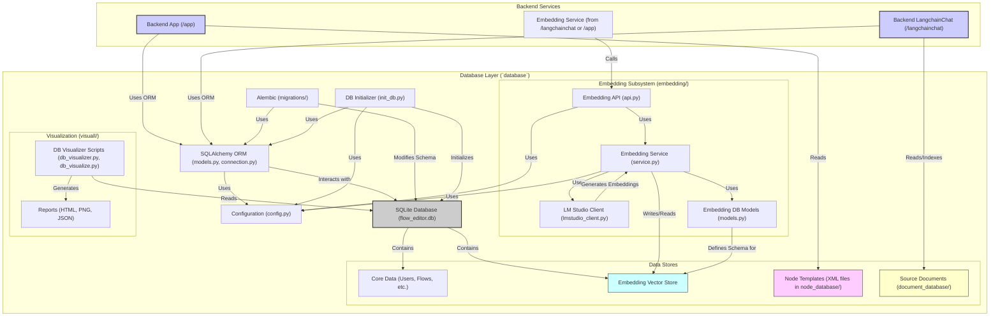

# Database Analysis (`database`)

## 功能概述

`database` 文件夹负责项目的持久化存储和数据管理。它采用了 **SQLite** 作为数据库引擎，并结合 **SQLAlchemy** ORM 和 **Alembic** 进行数据库迁移管理。

**主要特点与模块:**

- **核心数据库**: 使用 SQLite (`flow_editor.db`) 存储核心应用数据。
- **ORM 与迁移**: SQLAlchemy (`models.py`, `connection.py`) 用于对象关系映射，Alembic (`migrations/`) 用于管理数据库模式变更。
- **数据模型**: 定义了用户、流程 (Flows)、版本信息等核心数据表。
- **嵌入向量存储 (`embedding/`)**:
  - 专门处理和存储文本嵌入，支持 RAG 功能。
  - 包含独立的模型、服务、API 和配置。
  - 集成了 `lmstudio_client.py`，可能使用本地 LLM 服务生成嵌入。
- **节点模板存储 (`node_database/`)**:
  - 以 XML 文件形式存储流程编辑器可用的节点类型定义。
- **文档存储 (`document_database/`)**:
  - 存储用于 RAG 的源文档（如 XML 文件和特定目录下的文档）。
- **数据库可视化 (`visuall/`)**:
  - 包含生成数据库结构图、数据报告和快照的脚本及产物（`.png`, `.json`, `.html`）。

## 开发进度

- **结构**: 规范，使用了标准的 ORM 和迁移工具。
- **核心存储**: 基础数据存储功能已实现并包含数据。
- **RAG 支持**: 嵌入向量的生成和存储机制已建立。
- **节点/文档**: 节点模板和源文档的管理方式已确定。
- **可视化**: 开发了数据可视化工具，表明对数据状态的关注。
- **状态**: 数据库层功能相对完善，为后端应用提供了必要的数据支持。

## 组件交互图 (Mermaid)

**注意:** 该图表展示了 `database` 目录内部件以及它与后端服务的推断交互。嵌入子系统与后端服务的具体交互方式（是通过 API 还是直接调用服务）需要查看代码确认。节点模板和文档存储的具体使用方式也可能有所不同。
