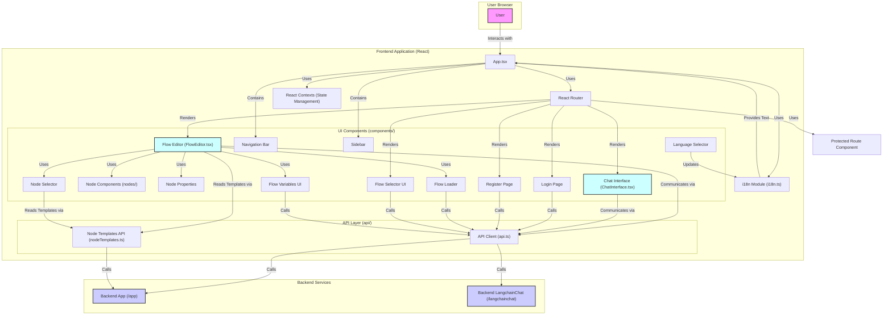

# Frontend Analysis (`frontend`)

## 功能概述

`frontend` 文件夹包含一个基于 **React** 和 **TypeScript** 构建的现代单页应用程序 (SPA)。其核心功能是提供一个**可视化 AI 工作流编辑器**和一个**聊天界面**，与后端服务（`backend/app` 和 `backend/langchainchat`）进行交互。

**主要特点与模块:**

- **框架与技术栈**: React, TypeScript, CRACO (用于配置覆盖), CSS, 可能使用 React Context API 进行状态管理。
- **核心功能组件**:
  - `FlowEditor.tsx`: 可视化工作流编辑器，允许用户拖拽、连接节点，配置属性。
  - `ChatInterface.tsx`: 用户与 AI 进行聊天的界面。
- **工作流相关组件**:
  - `nodes/` (目录): 包含不同类型的流程节点组件。
  - `NodeProperties.tsx`: 编辑节点属性的界面。
  - `NodeSelector.tsx`: 选择不同类型节点的界面。
  - `FlowLoader.tsx`: 加载工作流。
  - `FlowSelect.tsx`: 选择已有工作流。
  - `FlowVariables.tsx`: 管理工作流变量。
- **用户认证**: `Login.tsx`, `Register.tsx`, `ProtectedRoute.tsx`。
- **国际化**: `i18n.ts`, `LanguageSelector.tsx`。
- **API 交互**: `api/api.ts` (主要逻辑), `api/nodeTemplates.ts` (节点模板)。
- **基础 UI**: `NavBar.tsx`, `Sidebar.tsx`, `DraggableResizableContainer.tsx` 等。

## 开发进度

- **结构**: 清晰，遵循 React 项目组织规范。
- **核心功能**: 可视化流程编辑器和聊天界面两大核心功能已开发，且较为完善（代码量大）。
- **功能**: 丰富，涵盖了流程设计、执行（通过后端）、聊天、用户管理、多语言等。
- **技术**: 使用了现代前端技术栈。
- **状态**: 可能处于活跃开发或迭代阶段。

## 组件交互图 (Mermaid)

**注意:** 该图表基于文件结构和组件名称推断，实际的状态管理和组件交互细节可能更复杂。APIClient 与后端服务的具体对应关系需要查看代码确认。
