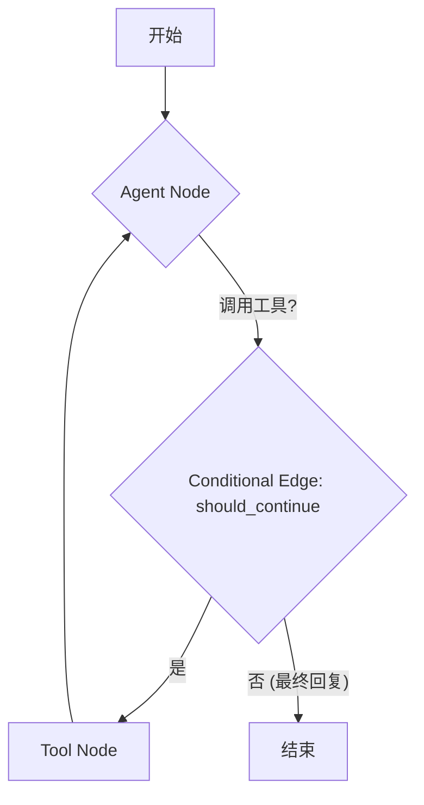
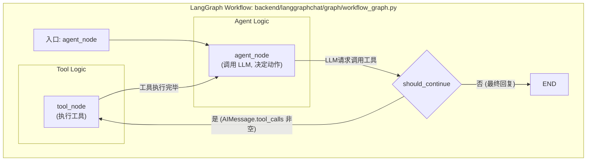

## LangGraph 图流程详解

LangGraph 的图并非一个可见的、静态的图像文件，而是在代码中动态构建和执行的。关键的图定义和编译逻辑在 `backend/langgraphchat/graph/workflow_graph.py` 文件中。

以下是该文件中定义图结构的关键部分和步骤：

1.  **状态定义 (`AgentState`)**：

    - 在 `backend/langgraphchat/graph/agent_state.py` (由 `workflow_graph.py` 导入) 中定义了图的状态。这个状态通常包含用户输入 (`input`)、消息历史 (`messages`)、以及可能的流程上下文 (`flow_context`) 等。

2.  **节点定义**：

    - `agent_node`: 这个异步函数是核心的决策节点。它接收当前状态，调用绑定的 LLM (大型语言模型)，并根据 LLM 的输出（可能是直接回复或工具调用请求）来更新状态。
    - `tool_node`: 这个异步函数负责执行 LLM 请求的工具。它使用 LangGraph 内置的 `ToolNode` 来处理工具调用和结果。

3.  **边的定义**：

    - `should_continue`: 这是一个条件边函数。在 `agent_node` 执行完毕后，此函数检查 `agent_node` 返回的 `AIMessage` 是否包含工具调用 (`tool_calls`)。
      - 如果包含工具调用，图会流向 `tools` (即 `tool_node`)。
      - 如果不包含工具调用（意味着是最终回复），图会流向 `END`，表示执行结束。
    - 从 `tool_node` 到 `agent_node` 的边：在工具执行完毕后，流程会返回到 `agent_node`，以便 LLM 可以根据工具执行的结果进行下一步决策。

4.  **图的构建和编译 (`compile_workflow_graph` 函数)**：
    - **初始化**: `workflow = StateGraph(AgentState)` 创建一个状态图实例。
    - **LLM 和工具准备**: 获取活动的 LLM 实例，并准备可用的工具列表 (来自 `flow_tools`)。
    - **系统提示格式化**: 从 `STRUCTURED_CHAT_AGENT_PROMPT` 中提取原始系统提示，并用工具描述和工具名称列表对其进行部分格式化。实际的 `flow_context` 会在 `agent_node` 每次被调用时动态填充。
    - **节点绑定**: 使用 `functools.partial` 将 `llm`、`tools` 和格式化后的 `system_message_template` 预先绑定到 `agent_node`。同样，将 `tools` 绑定到 `tool_node`。
    - **添加节点**: `workflow.add_node("agent", bound_agent_node)` 和 `workflow.add_node("tools", bound_tool_node)` 将准备好的节点添加到图中。
    - **设置入口点**: `workflow.set_entry_point("agent")` 指定图从 `agent` 节点开始执行。
    - **添加条件边**: `workflow.add_conditional_edges("agent", should_continue, {"tools": "tools", END: END})` 定义了从 `agent` 节点出发的条件路由。
    - **添加常规边**: `workflow.add_edge("tools", "agent")` 定义了从 `tools` 节点执行完毕后返回到 `agent` 节点的路径。
    - **编译**: `return workflow.compile()` 将定义好的图编译成一个可执行的 `Runnable` 对象。这个编译后的图实例会被 `ChatService` 获取并用于处理用户请求。

## 更详细的 Mermaid 图示

**注意**: 要查看 Mermaid 图的实际可视化效果，你需要使用支持 Mermaid 的 Markdown 查看器或编辑器（例如 VS Code 自带的 Markdown 预览，或 Typora、Obsidian 等），或者将 Mermaid 代码块粘贴到 [Mermaid Live Editor](https://mermaid.live/) 中。
