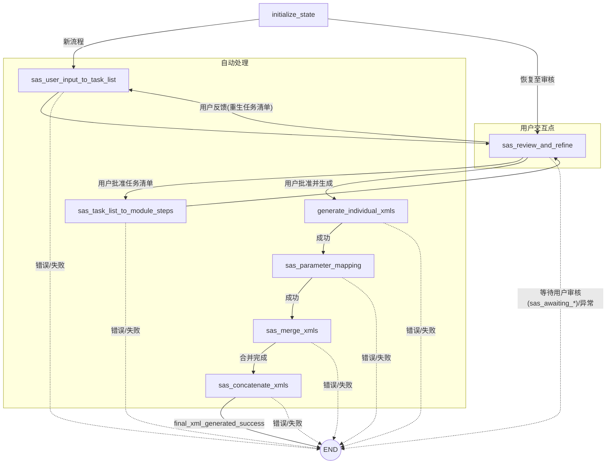

### 概览

- **核心**: 使用 `StateGraph(RobotFlowAgentState)` 构建的多阶段状态机，节点负责单一功能，条件路由基于 `dialog_state` 与错误标志。
- **入口/节点**: `initialize_state` → `sas_user_input_to_task_list` → 审核循环(`sas_review_and_refine`) → `sas_task_list_to_module_steps` → `generate_individual_xmls` → `sas_parameter_mapping` → `sas_merge_xmls` → `sas_concatenate_xmls` → 结束。
- **持久化**: 编译时可注入 `checkpointer`，在每步执行后持久化 `RobotFlowAgentState`。

### 流程图（Mermaid）

### 关键要点

- **路由依据**: `route_after_*` 系列函数根据 `dialog_state`、`is_error`、`completion_status` 选择下一节点或 `END`。
- **状态对象**: `RobotFlowAgentState` 持有 `messages`、`dialog_state`、`sas_step1_generated_tasks`、`sas_step2_module_steps`、`generated_node_xmls`、`run_output_directory` 等关键数据，贯穿全流程。
- **可视化**: 可用 `backend/sas/visualize_graph.py` 生成 Mermaid PNG（内部用 `graph.get_graph(xray=1).draw_mermaid_png()`）。
- **代码位置**: 图构建逻辑位于 `backend/sas/graph_builder.py` 的 `create_robot_flow_graph` 函数中。
