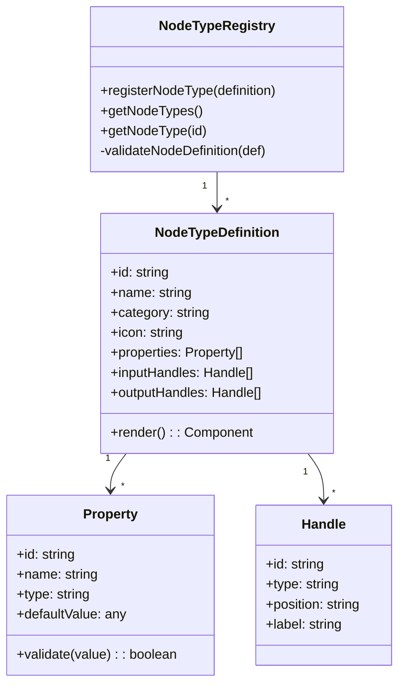
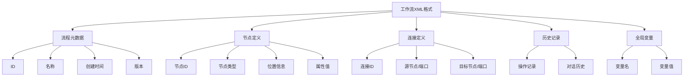
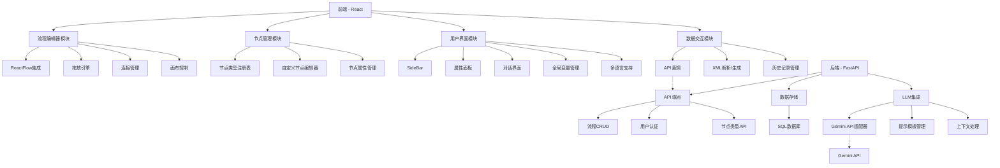

# 视觉工作流编辑器实施计划

基于对当前项目的分析和您提供的优先需求，我制定了以下实施计划。

## 1. 项目当前状态摘要

### 前端
- 基本的ReactFlow集成
- 简单的节点类型系统（仅有四种基本类型）
- 基础的流程保存/加载功能
- 初步的LLM集成通过ChatInterface
- 全局变量管理功能

### 后端
- FastAPI基础结构
- 基本的流程CRUD操作
- 简单的LLM调用接口
- 用户认证系统

### 主要缺失功能
- 高级拖放和连接功能
- 自定义节点类型系统
- XML导出/导入功能
- 对话和修改历史记录
- Gemini API集成
- 多语言支持实现

## 2. 实施路线图

```mermaid
gantt
    title 视觉工作流编辑器实施计划
    section 1. 流程图基础功能
    增强拖放体验           
    优化节点连接逻辑       
    添加自动布局功能       
    
    section 2. 自定义节点系统
    节点类型注册框架       
    节点模板编辑器        
    节点属性验证系统       
    
    section 3. 导入/导出功能
    XML格式定义           
    流程导出功能           
    流程导入功能           
    历史记录系统           
    
    section 4. LLM集成
    Gemini API集成        
    提示模板系统           
    节点生成优化           
    
    section 5. 国际化支持
    i18n框架设置           
    生成基础翻译           
    实现语言切换功能      
```

## 3. 详细实施计划

### 阶段1：增强流程图基础功能

#### 1.1 增强拖放体验
**目标**: 优化节点拖放至画布的体验

```mermaid
sequenceDiagram
    参与者 User
    参与者 Sidebar
    参与者 NodeSelector
    参与者 ReactFlow
    参与者 FlowEditor
    
    User->>Sidebar: 打开侧边栏
    User->>NodeSelector: 选择节点类型
    NodeSelector-->>Sidebar: 触发节点拖动事件
    Sidebar-->>ReactFlow: 创建节点预览
    User->>ReactFlow: 拖动至目标位置
    ReactFlow-->>FlowEditor: 添加节点至流程图
    FlowEditor-->>ReactFlow: 更新画布渲染
```

**实现步骤**:
1. 修改`NodeSelector.js`，添加拖动源功能
2. 增强`Sidebar.js`，实现拖动事件传递
3. 优化`FlowEditor.js`，改进节点放置逻辑
4. 添加视觉反馈和对齐辅助功能

#### 1.2 优化节点连接逻辑
**目标**: 提升节点间连线的便捷性和可靠性

**实现步骤**:
1. 增强节点连接点(handles)的视觉呈现
2. 实现节点连接类型验证（确保兼容节点才能连接）
3. 添加连接生成的智能建议
4. 优化连接路径算法，避免连线交叉

#### 1.3 添加自动布局功能
**目标**: 提供流程图的自动整理和美化功能

**实现步骤**:
1. 实现多种布局算法（分层布局、力导向布局等）
2. 添加布局选项控制面板
3. 实现节点之间的自动间距调整
4. 添加流程图缩放和适配视图功能

### 阶段2：自定义节点系统

#### 2.1 节点类型注册框架
**目标**: 创建可扩展的节点类型系统



**实现步骤**:
1. 创建节点类型注册表管理系统
2. 定义节点类型的标准结构和接口
3. 实现节点类型的动态注册和加载
4. 在后端添加节点类型存储API

#### 2.2 节点模板编辑器
**目标**: 提供用户友好的界面，允许用户创建自定义节点类型

**实现步骤**:
1. 设计节点模板编辑界面
2. 实现属性编辑功能（添加、删除、配置属性）
3. 添加节点外观定制功能
4. 实现输入/输出句柄配置
5. 添加节点模板预览功能

#### 2.3 节点属性验证系统
**目标**: 确保节点属性有效性和一致性

**实现步骤**:
1. 实现属性类型系统（字符串、数字、布尔、选择、对象等）
2. 添加属性验证规则（必填、范围、格式等）
3. 开发实时验证反馈机制
4. 集成全局变量引用验证

### 阶段3：导入/导出功能

#### 3.1 XML格式定义
**目标**: 设计标准化的XML格式，用于流程图、历史记录的序列化



**实现步骤**:
1. 定义XML模式(Schema)
2. 实现流程图到XML的转换函数
3. 实现XML到流程图的解析函数
4. 添加XML验证功能

#### 3.2 流程导出功能
**目标**: 允许用户导出流程图为XML文件

**实现步骤**:
1. 在`FlowEditor.js`中添加导出按钮
2. 实现流程图序列化为XML的功能
3. 添加文件下载机制
4. 实现导出选项（是否包含历史记录等）

#### 3.3 流程导入功能
**目标**: 允许用户从XML文件导入流程图

**实现步骤**:
1. 在`FlowEditor.js`中添加导入按钮
2. 实现文件上传和解析机制
3. 添加导入验证和冲突检测
4. 实现流程图合并选项

#### 3.4 历史记录系统
**目标**: 跟踪并存储流程图的修改历史和对话历史

**实现步骤**:
1. 设计历史记录数据结构
2. 实现操作记录机制（添加节点、删除连接等）
3. 开发对话历史存储功能
4. 添加历史浏览和恢复功能

### 阶段4：LLM集成

#### 4.1 Gemini API集成
**目标**: 将系统与Gemini LLM服务集成

```mermaid
sequenceDiagram
    参与者 ChatInterface
    参与者 API Service
    参与者 Backend
    参与者 Gemini API
    
    ChatInterface->>API Service: 发送生成请求
    API Service->>Backend: 调用LLM服务
    Backend->>Gemini API: 发送优化的提示
    Gemini API-->>Backend: 返回生成结果
    Backend-->>API Service: 处理并格式化结果
    API Service-->>ChatInterface: 更新UI显示结果
```

**实现步骤**:
1. 更新`llm.py`路由，集成Gemini API
2. 实现API密钥配置和管理
3. 开发请求/响应格式转换
4. 添加错误处理和重试机制

#### 4.2 提示模板系统
**目标**: 开发灵活的提示模板系统，优化LLM交互

**实现步骤**:
1. 设计提示模板数据结构
2. 实现模板变量插值功能
3. 添加上下文增强机制（工作流上下文）
4. 开发模板管理界面

#### 4.3 节点生成优化
**目标**: 提升LLM生成节点的质量和准确性

**实现步骤**:
1. 优化节点生成提示
2. 实现生成结果验证和纠错
3. 添加生成节点的属性自动补全
4. 开发节点建议功能

### 阶段5：国际化支持

#### 5.1 i18n框架设置
**目标**: 建立多语言支持框架

**实现步骤**:
1. 配置`i18next`框架
2. 创建翻译文件结构
3. 实现翻译键提取工具
4. 设置语言检测和默认语言

#### 5.2 生成基础翻译
**目标**: 为所有UI元素生成中文、日文和英文翻译

**实现步骤**:
1. 提取所有UI文本为翻译键
2. 利用Gemini API生成多语言翻译
3. 组织翻译文件（按功能模块）
4. 实现翻译质量检查

#### 5.3 实现语言切换功能
**目标**: 允许用户在不同语言间切换

**实现步骤**:
1. 优化`LanguageSelector.js`组件
2. 实现语言设置的持久化存储
3. 添加语言切换动画和反馈
4. 优化RTL(从右到左)语言支持

## 4. 技术架构图



## 5. 实施风险与缓解策略

| 风险 | 可能性 | 影响 | 缓解策略 |
|------|--------|------|----------|
| ReactFlow版本兼容性问题 | 中 | 高 | 在开发环境中锁定版本，详细测试升级 |
| Gemini API限制和延迟 | 高 | 中 | 实现本地缓存和失败重试机制 |
| 自定义节点系统复杂性 | 高 | 高 | 采用迭代开发方法，从简单实现开始 |
| XML格式的互操作性 | 中 | 中 | 创建详细的XML模式和验证测试 |
| 多语言支持的维护成本 | 中 | 低 | 使用自动化工具和模板生成翻译 |

## 6. 建议的近期行动项目

1. **设置增强的ReactFlow环境**
   - 升级ReactFlow库到最新版本
   - 实现基础拖放功能的原型

2. **设计节点类型系统**
   - 创建节点类型数据结构
   - 实现基础的节点类型注册机制

3. **规划XML格式**
   - 定义XML模式文档
   - 创建基本的导入/导出功能原型

4. **集成Gemini API**
   - 创建API密钥和配置管理
   - 开发基础API集成测试

5. **国际化框架设置**
   - 配置i18next
   - 提取初始翻译键集